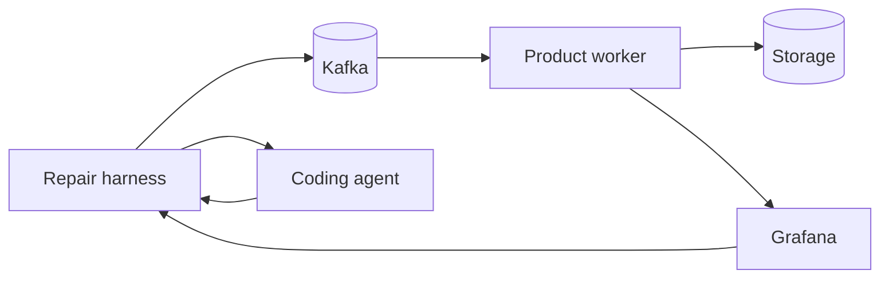
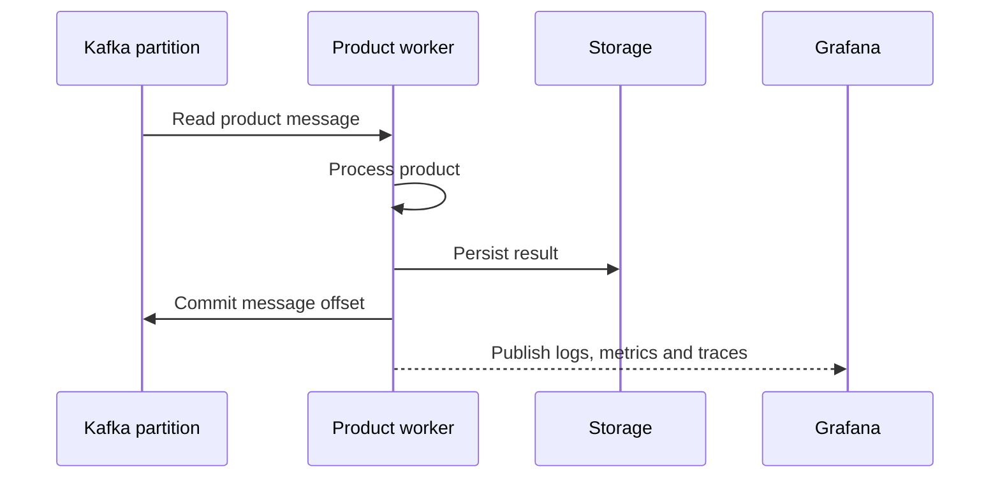
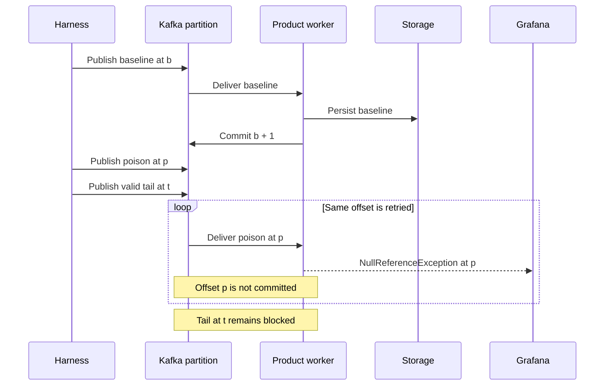
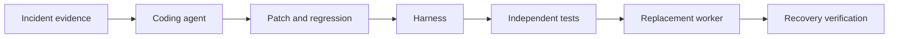
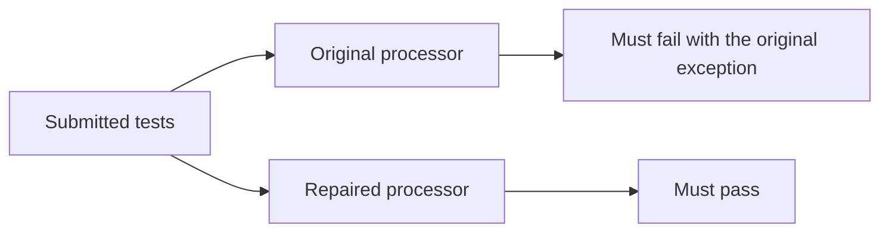
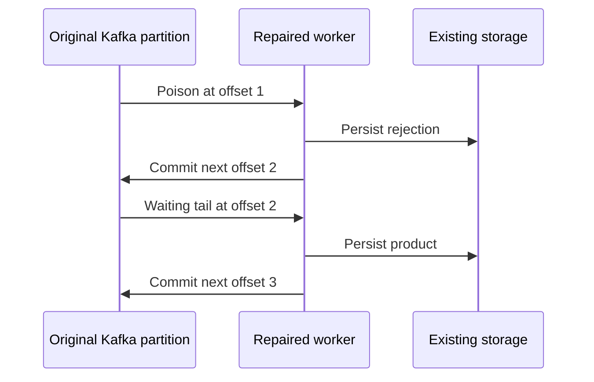

# Wake up call

You wake up to worst sound there is, pager duty ring tone. Before your brain registered what really happen, your hearth already beating as crazy. It get's to you quite quickly - that will not be a peaceful night.

You get to the desk with effort, open laptop lid, monitor is the only thing that lighten up dark room. Login, get to the alert, get to the dashboard.

You may know this story once to many, if you don't - praise it, systems do break, and when they do, you not only what to fix the issue, you just want to crawl back under the cozy covers.


# Investigation routine

As usual that might be anything, requests in legacy service started to fail all the sudden, website started to be unresponsive, number of failed kafka messages triggered an alert, you name it.

So you start tracking it down, getting from one dashboard to another, checking logs, putting the puzzle to whole.

The routine is always similar. First you need to prove that the alert is real. Then you search for the affected service, follow traces and logs, check what changed, inspect the data that triggered the failure, and build a hypothesis. Only after that can you touch the code. Even then, fixing the exception is not enough. You still need to prove that the service recovered, that no data was lost, and that the same message will not block the system again.

Most of that work is not creative. It is gathering evidence, correlating facts, and carefully checking assumptions while being tired and under pressure. That makes incident investigation an interesting place for an LLM: not as an oracle that gets production access and deploys whatever it wants, but as a restricted first responder that can prepare a tested hypothesis before a human joins.

# AI


LLMs took a big part of my life.

They took away some of my joy in simple programming. They took away those moments when a solution would suddenly flash into my mind, when all the blocks started to align, when code would just pour through my fingers and I didn’t want to lose a second of that productive moment.

I also lost the hard times — when nothing worked, when you already knew that the code you had wasn’t the final version, but you just didn’t have the right one yet. When a possible solution had to slowly burn its way through your mind.

Code was a pleasure. It was a gift after long meetings spent discussing the feature, the product. It was the reward for all the hard planning work. It was a relief — just you, the keyboard, and a coding poem waiting to be written.

Now it’s just another kind of work: delegating.

The Jira tickets are there, but you can no longer enjoy coding them. AI will do it — you just witness it happening. You ask for modifications, corrections, adjustments, until you reach the point where it’s simply good enough.

It’s not your poem anymore. It’s this oddly unfamiliar code. You watched it come into existence, but it didn’t feel any good.

The worst thing is that going back is very hard.

Even if the joy is gone, the thought of putting so much hard work into creating something yourself, when this technology is right there, is painful. The shortcut is always at your fingertips. It no longer matters as much if the solution isn’t perfect. At least it won’t be so exhausting.

Why am I even writing this then?

Because if that’s my career now, so be it.

But if you took away the good parts, you should definitely take away the bad ones too.

# Investigation harness

Getting back to investigation. Wouldn't that be nice, if LLM already give it a try to investigate the issue and even to fix it before your attendance is absolutely necessary? 

Exactly that proof of concept is main topic of that post. We will implement harness for LLM, that as soon as it discover the issue, it will orchestrate whole fixing operation and prepare decent information what happen and how system dealt with it.

## Architecture



Our worker is simple example process that's subscribe to kafka topic and do process product messages on it. Each product is persisted on disk. It does publish telemetry about it's actions, which finally lands on grafana.

The worker publishes counters for successfully processed, rejected, and failed records. It also reports its heartbeat, the timestamp of the last success, the committed-next offset, the partition log-end offset, consumer lag, and the timestamp of the last successful broker observation.



The harness queries Grafana and opens an incident when processing failures repeat at the same Kafka offset, consumer lag remains positive, and successes remain flat.

The harness is our repair orchestrator. When the detection rule matches, it starts the repair process. First, it proves that the issue remains after a worker restart. Then it prepares the agent input: `evidence/alert.json`, the structured failure log in `evidence/worker-errors.log`, and the captured Kafka records in `evidence/kafka-records.json`.

# What are we trying to prove?

Question is, do we already have the technology that we can relay on, that will diagnose and repair active incidents (at least of some kind), providing evidence, deployment, final verdicts - and all of it, with reasonably cheap models. 

That post it's not about installing some ready-to-go boxes of datadog, sentry, or whatever that might already be proposing those - it's about learning by doing and preparing proof that we can implement that by ourselves and observe results of it.

Am well aware (am maintaining systems of various sizes for more then decade) that most dangerous bugs are not usually simply code edge case, but some unrelated (at first glance at least) connotations, but we need to starting point (reader may treat evolution of that harness as homework 😅).

We will deal with narrow, small harness that hopefully with enough context and guardrails will successfully fix end-to-end easy code bug.

# The controlled incident


During experiment three messages will be published:

### First
First is a valid baseline product - we will wait until it's persisted and committed, which will prove that our experiment setup works as expected. 

```json
{
  "productId": "P-baseline",
  "productType": "Physical",
  "price": 100
}
```

### Second

Then, poison payload with empty `product type`:

```json
{
  "productId": "P-poison",
  "productType": null,
  "price": 100
}
```

On effect of which handing code:

```csharp
string? productType = root.TryGetProperty("productType", out var typeElement)
    ? typeElement.GetString()
    : null;

var normalizedType = productType!.Trim().ToLowerInvariant();
```

throws `NullReferenceException` unexpectedly while trying to normalize the type. It happens before worker is able to persist record and/or commit the kafka offset. 

Bug isn't the hardest one (however am pretty sure all of us saw this kind of them already as well) - but the experiment isn't about solving hardest puzzles, rather to proof repair loop working.

### Third

Then, just after poison one, valid product message is published. That tail message is important - it becomes a litmus test. Because of bug in code, our worker is stuck on poison message and cannot reach tail.

```json
{
  "productId": "P-tail",
  "productType": "Digital",
  "price": 50
}
```

### Have you tried...


Just for proof that harness was written by humans - we will start with what typically we (IT guys) would recommend as first hand advice - as soon as we discover ongoing problem, we will restart the worker and check again. Of course that will not fix this specific problem - but, it always worth a shot, right?

---
Finally, the diagram that's summarize this paragraph in on shot. Worker is well and alive, then failures are keep increasing, while successes are not. Our process is stuck in place.



# Detecting a blocked consumer

The annoying thing about this incident is that the worker never really dies. The process is running, and it's quite busy. Unfortunately, all that activity goes into failing on the same product over and over again. Meanwhile, `P-tail` sits behind it, perfectly valid and completely out of reach.

Checking whether the process is alive doesn't get us very far. We need to notice that it has **stopped doing useful work**.

For this experiment, Grafana evaluates a simple rule:

- The worker instance has reported at least three processing failures.
- Consumer lag is positive.

The harness waits for this alert through Grafana's API. Together with the restart check from the previous section, we now have a worker that keeps failing, pending work it cannot reach, and proof that turning it off and on didn't help. Time to try something slightly more sophisticated 😂.

Before starting the agent, the harness saves the alert, failure logs and captured Kafka records. Those files preserve what happened even after the dashboard turns green again.

The useful part of the failure log is quite small:

```json
{
  "event": "product.processing.failed",
  "topic": "products-a37fdda7",
  "partition": 0,
  "offset": 1,
  "exception_type": "System.NullReferenceException"
}
```

The full log also contains the stack trace. We already know the faulty line, but the agent hasn't seen it yet. It starts with an operational symptom and a repository to investigate.

# Handing over the investigation

For the coding session, my C# harness starts [OpenCode](https://opencode.ai/docs/cli/) inside a container. The agent gets a disposable copy of the worker, its tests, and the incident evidence.

The task is deliberately short. This is the important part of the prompt:

```markdown
A Grafana alert fired for the product worker. Start with the alert
in `evidence/alert.json` and the structured failure log in
`evidence/worker-errors.log`.

Investigate the alert and repair the application.

Add a regression test. It must exercise the worker through Kafka
and verify externally observable behavior such as durable output
and committed offsets.
```

Having that, the agent can search the code, change the processor, and add a functional regression. It cannot deploy its own proposal or change the harness's acceptance checks.

There is also no Docker socket or connection to the application network in the coding container. The original Kafka partition stays outside its reach.



What's important is **who decides that we're done**. The agent submits a candidate. The harness runs it and checks what happened.

That sounds obvious, but *“I fixed it, all good”* is a surprisingly tempting stopping point when a model gives you a confident answer.

# What the agent changed

In the successful run, the agent read the failure logs and alert, then followed them into the processor, worker loop, output storage and functional tests.

It found the null-forgiving call we saw earlier. Missing `productType` becomes `null`, and calling `Trim()` throws before the worker can persist any outcome or commit the record.

But removing the exception isn't the whole requirement. **What should happen to an invalid product?**

Our processor already returns explicit rejection results for invalid input. The agent followed that existing pattern and added this check before normalization:

```diff
- var normalizedType = productType!.Trim().ToLowerInvariant();
+ if (string.IsNullOrWhiteSpace(productType))
+ {
+     return ProcessingResult.Rejected(productId, "unsupported_product_type");
+ }
+
+ var normalizedType = productType.Trim().ToLowerInvariant();
```

Now missing, null, empty and whitespace types become rejected records. The worker can persist that rejection and continue.

The agent chose `unsupported_product_type`, which the application already used. My known-good fixture uses `missing_product_type` instead. The harness accepts either reason here; it requires an explicit rejection.


For the regression, the agent published a product without a type. The test uses real Kafka and the real worker, following the [functional-testing approach from my earlier post](https://bulatgrzegorz.github.io/complete-guide-to-functional-tests/):

```csharp
[Test]
public async Task MissingProductTypeIsRejectedPersistedAndCommitted()
{
    // Starts the real worker, publishes through Kafka, then waits
    // for persisted output and the consumer group's committed offset.
    var ledger = await RunScenario("""{"productId":"P-2","price":25.5}""");

    await Assert.That(ledger.Records).HasSingleItem();
    await Assert.That(ledger.Records[0].Disposition).IsEqualTo("rejected");
    await Assert.That(ledger.Records[0].ReasonCode).IsEqualTo("unsupported_product_type");
    await Assert.That(ledger.Records[0].ProductId).IsEqualTo("P-2");
}
```

`RunScenario` uses a separate topic and consumer group for each test. Those few assertions already check more than whether the processor stopped throwing: the rejection must be stored and the offset committed. Proving that our original `P-tail` gets processed is still the harness's job during live recovery.

The session wasn't entirely smooth. The agent initially used a TUnit assertion that didn't compile, corrected it, then tried to run the functional tests. Those couldn't start because the coding container had no Docker socket.

So it submitted a patch, a compiling regression, and an honest explanation that it couldn't execute the scenario there. **The harness still had to prove the repair.**

# Making the test earn its green

The agent wrote both the fix and its test. They could agree with each other and still be wrong.

A test checking only that the processor no longer throws would miss a patch that silently drops the product. Our exception counter would look healthier, while the data would be gone.

The harness therefore runs the submitted tests twice:



With the original processor, the new scenario gets stuck behind the malformed record. With the repaired processor, the rejection is persisted and the next product gets processed.

The current red check is fairly simple: a nonzero test-process exit and `NullReferenceException` in its log. It gives us evidence that the regression reaches the original failure, though it isn't a sophisticated inspection of individual test results.

The harness also checks four malformed inputs independently: omitted, null, empty and whitespace `productType`. Each must return a rejection.

Before running these checks, it freezes the submitted source. That same source is then used to build the replacement worker, keeping a connection between **what passed the tests and what gets deployed**.

Having all that green is encouraging. But our original `P-tail` hasn't moved a millimeter yet.

# Back to the waiting product

The broken worker has been stopped during the repair. Kafka, the consumer group and the stored baseline result are still there.

We don't publish another poison record into a fresh environment and call it recovery. The replacement has to face **the state left by the failed worker**.

In this run, the baseline was at offset `0`, the poison at `1`, and the tail at `2`. The committed-next offset stayed at `1`, so the replacement resumes with the poison.



Finally, our tail gets its turn.

Notice the order: **persist the outcome, then commit**. A commit before persistence could lose work after a crash. Persisting first means a record may be replayed, so the worker identifies stored outcomes by topic, partition and offset to avoid applying them twice. The [Kafka client documentation](https://docs.confluent.io/kafka-clients/dotnet/current/overview.html) explains the delivery consequences of commit timing.

After the tail recovers, the harness publishes one more valid product with a newly generated ID. That record didn't exist while the agent was preparing its patch.

Recovering the known backlog is good. We also want to know that the worker can handle whatever arrives next.

# Did it work?

The harness checks the output and Kafka's committed offset independently. For the successful run, the final state was:

| Record | Result |
| --- | --- |
| Baseline | Original stored result preserved |
| Poison | Explicitly rejected |
| Tail | Processed with its original values |
| Fresh probe | Processed |
| Partition | Drained, committed-next offset `4` |

It also checks for extra or duplicate records and matches the expected products and payload hashes.

These checks belong together. Zero lag alone could mean somebody skipped the records. A correct-looking output file alone doesn't establish where the consumer group will resume.

In this run, **both the stored outcomes and broker state agreed**.

The model was `openai/gpt-5.4-mini`. From preparing the coding session to freezing its submission took about 89 seconds. Independent testing took another 39 seconds, and replacement plus live recovery verification took roughly 2 seconds.

The complete run, including setup, detection and report generation, finished in about 3 minutes and 9 seconds. One successful attempt answers whether this loop can work for this incident. It doesn't tell us how reliably it would work across different incidents or repeated attempts.

# Something useful to wake up to

There is still one person waiting for the result: the sleepy developer opening the laptop.

A green status is nice. But I would still want to know what broke, what changed, and what happened to the products.

The harness returns to the saved OpenCode session with the verification results and asks for a post-mortem. The agent now has both its investigation and the outcome established independently by the harness.

Here is an excerpt from the agent's generated post-mortem, with some sections omitted:

```markdown
## Summary
The product worker was blocked by a Kafka record whose payload did not contain a usable `productType`. `ProductProcessor` threw `NullReferenceException` on that path, which prevented the worker from making forward progress on the partition.

## Root Cause
`ProductProcessor.Process` read `productType` and then used the null-forgiving operator before trimming and lowercasing it. When `productType` was missing, null, empty, or whitespace, the code dereferenced a null value and threw `NullReferenceException`.

This is supported by the stack traces in `evidence/worker-errors.log` and the source diff in `evidence/source.diff`.

## Resolution
The processor was changed to normalize `productType` only when present and to reject missing or blank values with `unsupported_product_type` instead of throwing.
An end-to-end functional regression test was added that publishes a payload without `productType` through Kafka and verifies durable rejection output and committed offsets.

## Validation
The trusted verification record reports `outcome: resolved` and confirms `baseline_preserved`, `poison_rejected`, `tail_processed`, `probe_processed`, `no_extra_records`, and `partition_drained`.
The trusted test results record `red_control: failed_as_expected` and `candidate: passed` across the documented policy variants.
```

Useful, but it needed reading. For example, it described a null or empty type as a possible cause of the null-reference crash. An empty string wouldn't cause this particular exception; calling `Trim()` on `null` would.

The harness checks that the required report sections exist. It doesn't establish that every sentence is correct.

**The report helps me navigate the evidence. I still need to follow its claims back to that evidence.**

# Wrapping up

Looking at that tiny validation change, all this may seem like a lot of effort. And it is.

But the interesting part was the journey from a runtime failure to a verified recovery. The model changed a few lines. Around those lines, the harness captured evidence, ran the regression against both versions, preserved the incident and checked the recovered data.

Our tail product gave the experiment something concrete to answer for. It was waiting before the investigation started. The repair became useful when the replacement rejected the original poison record and let that waiting work continue.

This is still one simple defect, one partition and a local experiment. For a real service, a tested proposal with evidence attached would already give the human responder a much better starting point.

I still want some of the pleasure of writing code myself. But collecting logs, reproducing the same failure and checking offsets at an unreasonable hour? That part I'm quite happy to delegate.

If AI is taking a share of the good parts, it can take a shift on the bad ones too. 🤞

Full code example can be found [in this repo](https://github.com/bulatgrzegorz/incident-repair-harness).
